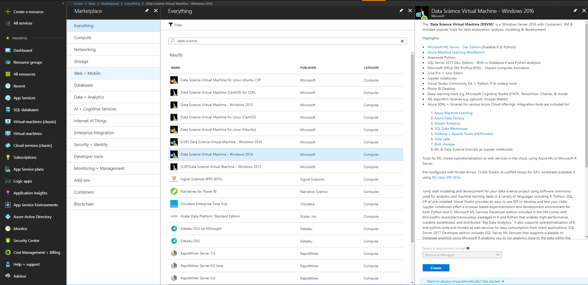

## 亚马逊商城服装商品评论的情感分析
### 实验目的
本实验使用网络开源的亚马逊商城服装评论数据库，实现针对评论的正负向情感分析。该实验采用Azure数据科学虚拟机作为训练环境，使用预装的Keras和Cognitive Toolkit作为开发环境，向读者展示了如何通过Azure的AI服务实现深度学习场景(Bidirectional LSTM)。
### 实验环境
- Azure数据科学虚拟机: NC6型; Windows Server 2016系统
- Keras 2.0.8
- Cognitive Toolkit 2.2
- Anaconda Python 2.7 with CUDA 8.0


#### 1. 虚拟机准备
1) 创建Azure 数据科学虚拟机
在全球版Azure的管理门户上找到Azure数据科学虚拟机，开始创建。注意选择Windows 2016系统，HDD磁盘类型，NC6型号虚拟机。

​
2) 访问Azure数据科学虚拟机
创建成功后，通过点击Connect按钮，连接虚拟机。


#### 2. 训练环境配置
1) 配置Keras的后台为CNTK。通过运行下面的python代码来找到.keras文件夹及keras配置文件keras.json的位置,将backend这一项的值改成cntk。有两个可能的位置，一个是c:\users\username\\.keras，一个是c:\Windows\system32\config\systemprofile\\.keras
```Python
import os
print(os.path.expanduser('~'))
```
2) 如果使用Jupyter Notebook，选择cntk-py34这个环境运行。

3) 如果直接使用Python环境，在c:\Anaconda\envs下面运行activate py35，启动虚拟环境。

## 数据说明
数据是来自亚马逊电商服装区的商品评论，存储在data_clothing.csv文件中，包括英文文本评论，及对应的情感标签，正向为1，负向为0。

## 参考来源
- https://github.com/thenomemac/IMDB-LSTM-Tutorial
- https://github.com/asanilta/amazon-sentiment-keras-experiment

## 代码说明
见AmazonReview.ipynb

## 测试模型
运行test.py文件,测试该情感分析模型。注意要先找到keras.json文件的位置（与Jupyter Notebook对应keras.json位置可能不一样），设置backend为cntk。
```
python test.py "The jeans is awesome."
```

 