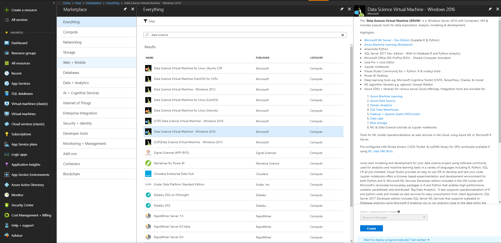
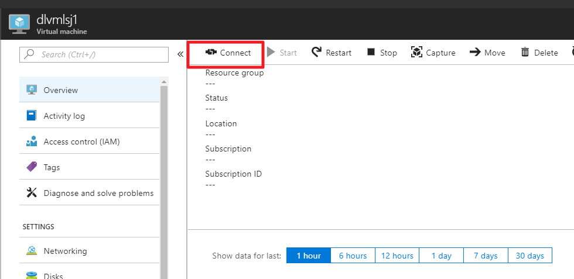

## Sentiment analytics of clothes reviews on Amazon

### Purpose
This experiment is to do sentiment analytics based on Amazon online store's clothes reviews datasets. You'll use Azure Data Science Virtual Machine as training environment, with Keras and CNTK as deep learning framework, to implement a deep learning scenario (Bidirectional LSTM).

### Experiment environment
- Azure Data Science Virtual Machine: NC6 type; Windows Server 2016 system
- Keras 2.0.8
- Cognitive Toolkit 2.2
- Anaconda Python 2.7 with CUDA 8.0


#### 1. Virtual machine preparation

1) Creating Azure Data Science Virtual Machine

You can find Azure Data Science Virtual Machine in global Azure portal, and start creating. Notice to choose Windows 2016 system, HDD disk, and NC6 size.


​
2) Visiting Azure Data Science Virtual Machine

After successfully created, click "Connect" button to remotely connect to the virtual machine.



#### 2. Training environment preparation

1) Config Keras's backend as CNTK

You can run the below Python code to find where .Keras folder and keras configuration file (keras.json) are, and set the "backend" value as cntk. There are two possible locations: one is c:\users\username\\.keras, the other is  c:\Windows\system32\config\systemprofile\\.keras
```Python
import os
print(os.path.expanduser('~'))
```
2) If prefer Jupyter Notebook，you can choose "cntk-py34" as the environment.

3) If prefer Python environment, you can choose virtual environment under "c:\Anaconda\envs" and run "activate py35".

## Data introduction
Dataset is reviews of clothes from Amazon online store, in data_clothing.csv file，including English text reviews, and sentiment tags, positive = 1, and negetive = 0.

## Github reference
- https://github.com/thenomemac/IMDB-LSTM-Tutorial
- https://github.com/asanilta/amazon-sentiment-keras-experiment

## Code description
Refer to AmazonReview.ipynb

## Test the model
Run test.py file, and test the sentiment analytics model. Notice that keras.json file needs to be set CNTK as backend.
```
python test.py "The jeans is awesome."
```

 